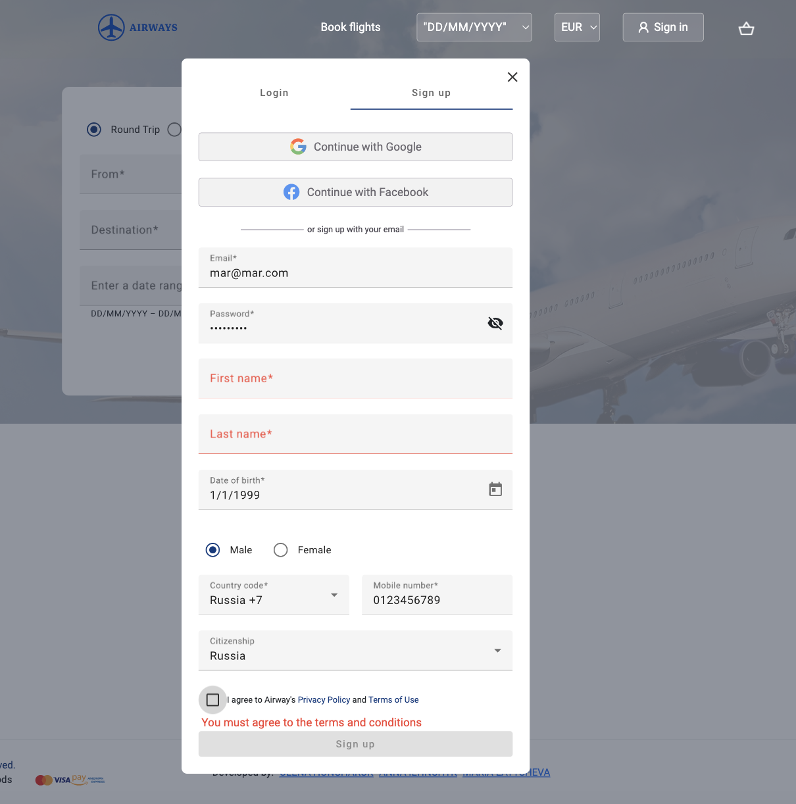
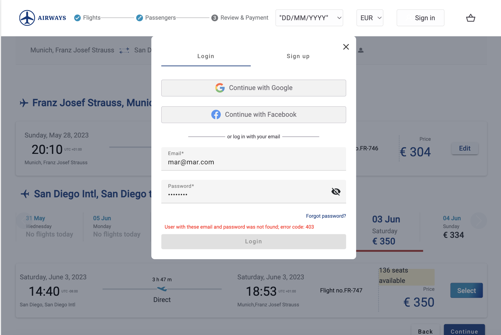
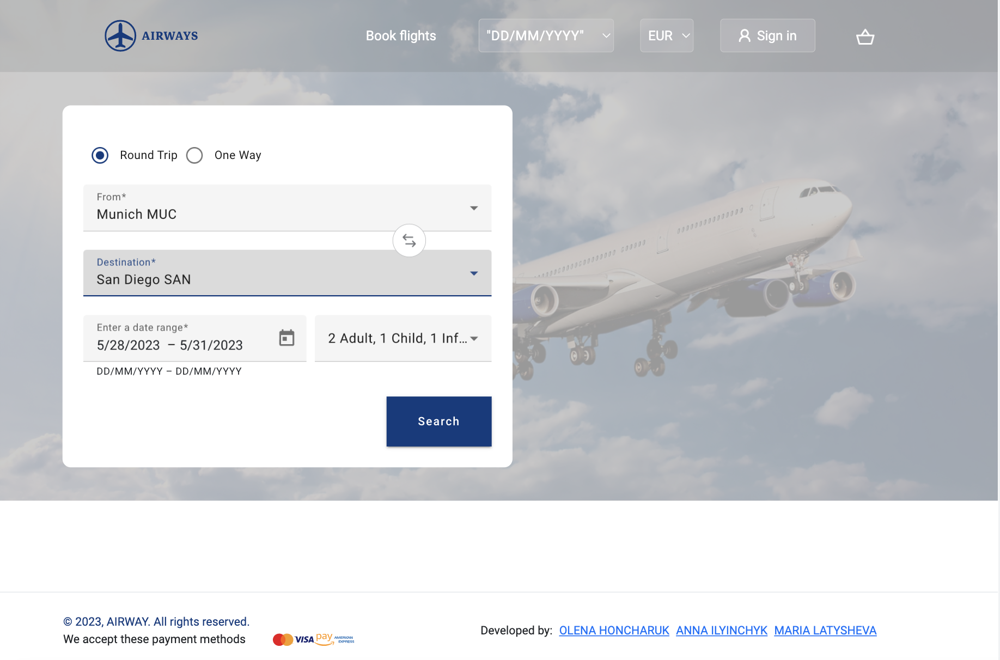
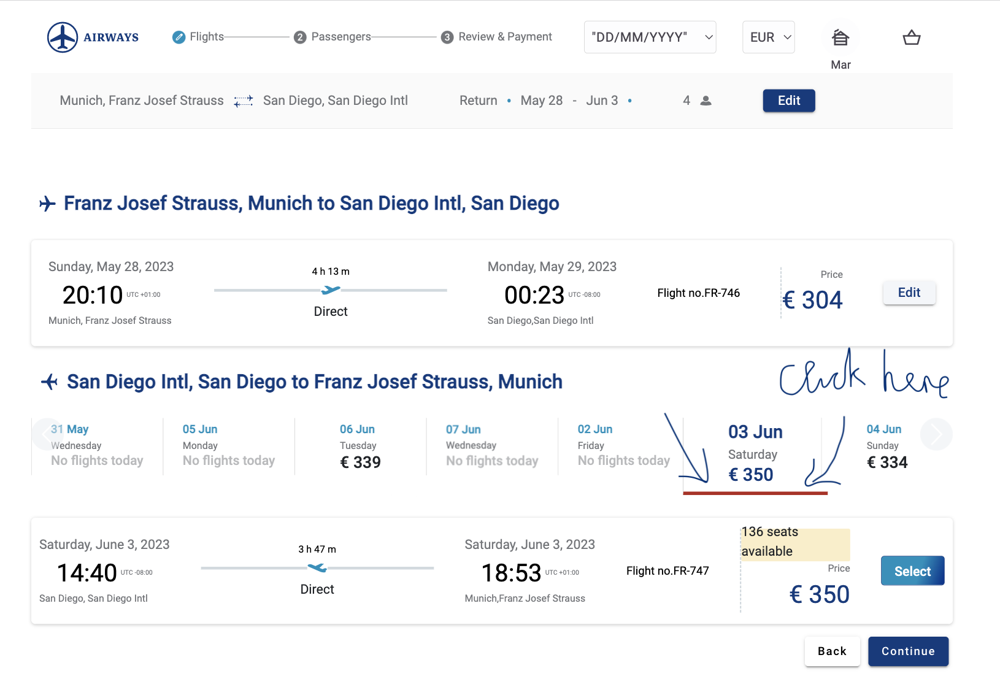
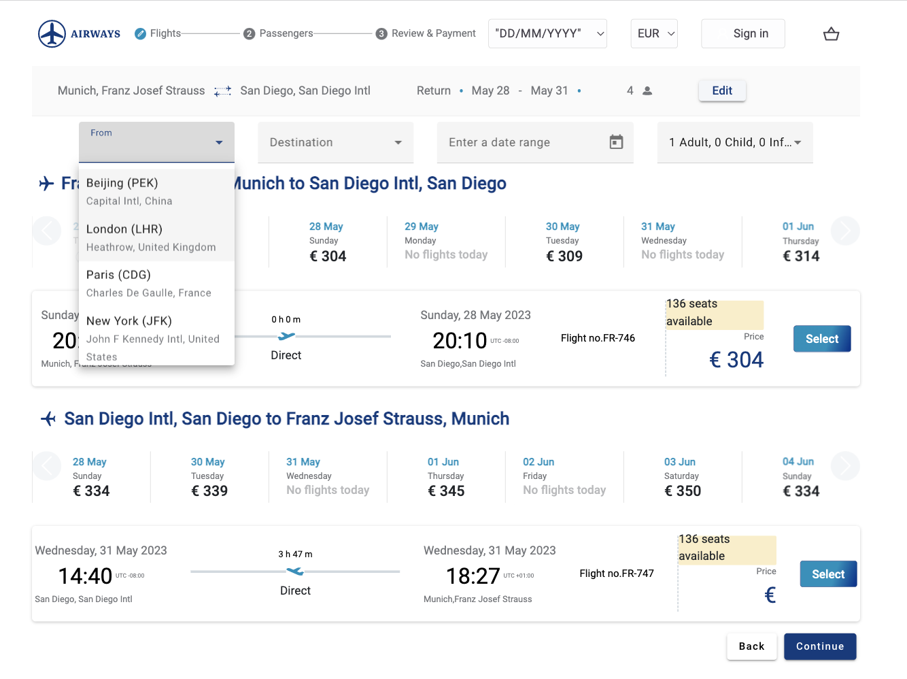
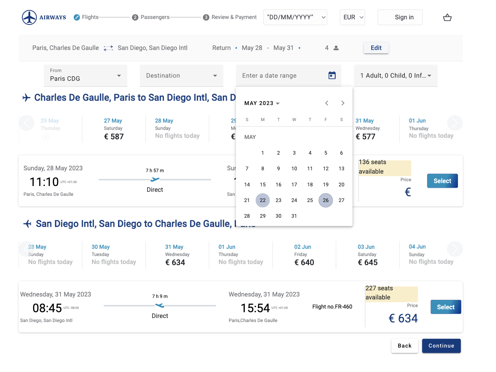
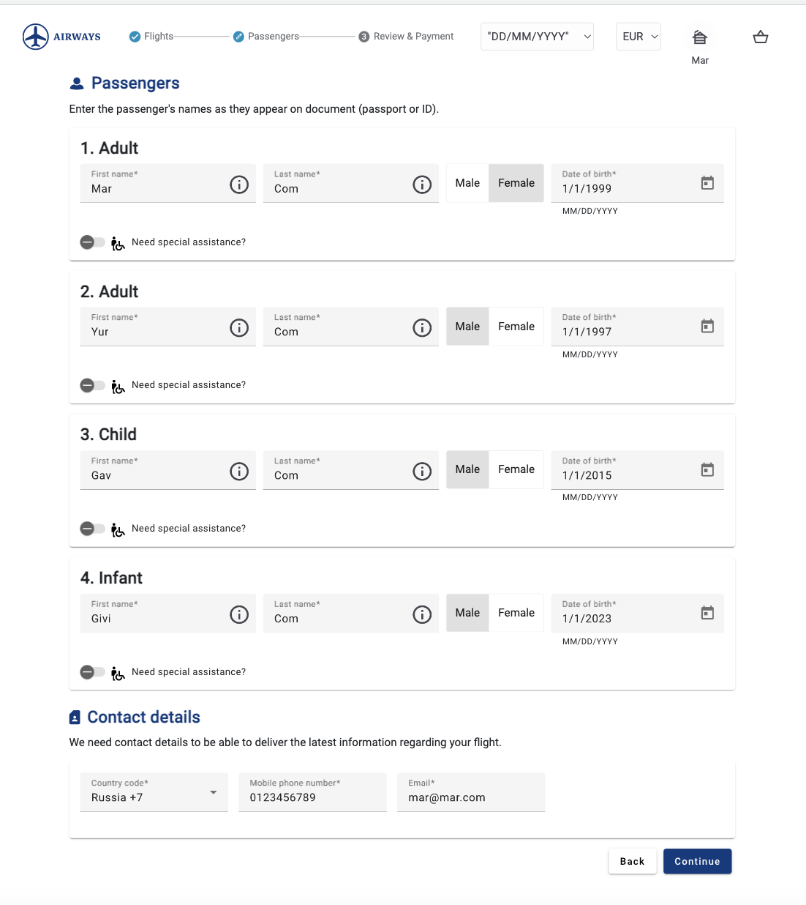
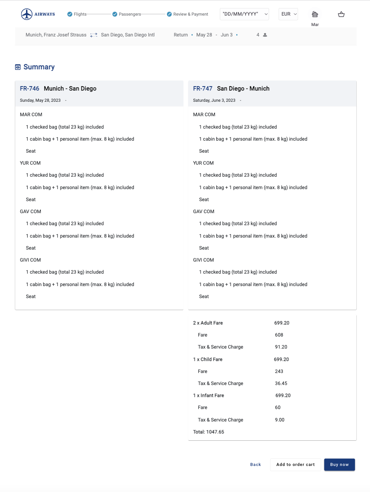
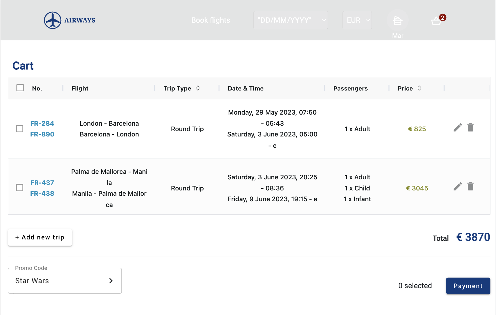
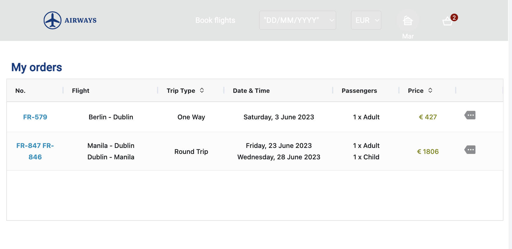

# Aviator

This is an Angular app to book flights. It was developed by our team of three students as part of the Rolling Scopes School course on Angular: 
 - Maria Latysheva https://github.com/mlatysheva
 - Anna Ilyinchyk https://github.com/annakolesnikova
 - Olena Honcharuk https://github.com/olena-web

## Description 

Aviator is an SPA to book flights that has the following features:

- User Registration: The app has a user registration and login features. A user has to be authenticated to book a flight. The app stores the user profile, currently booked trips and completed orders for the given user.

- Flight Search (Main) Page: The app provides a simple and intuitive functionality to search for flights. This includes options to select the origin and destination, type of flight (one-way or round-trip), and the number and age of passengers.

- Flight Selection Page: Once the user has entered their search criteria, the app displays all available flights along with the dates, prices, and the available number of seats.

- Editing option: The user can edit the previously selected options:

- Booking Process Page: After selecting a flight, the user is taken to another page where s/he can provide passenger data and contact information to complete the booking. Once a user has provided booking details, s/he will see the summary with all the flight information provided.

- Booking Summary Page: This page shows all the data provided before the checkout. The user can make the payment now, or add the booking to the shopping cart to be paid for later.

- Shopping Cart Page: This page shows all previously added bookings that are awaiting payment.

- User Account Page: This page shows all bookings paid by the user and provides the possiblity to view the booking summary.

## Installing and Running the app
- the backend is built with JSON-server and is located in the folder `backend`. Our repository `aviator` is built as a mono-repository with two packages - one for the frontend and the other - for the backend.
- `clone` or download the `develop` branch of the app
- `cd` into the folder where you downloaded the app
- run `npm run install:all` - to install the dependencies for both the frontend and backend
- run `npm run start:all` - to start the server and the app at the same time. The app will be running on https://localhost:4200 and the server will be running on https://localhost:3000

### Alternatively, you can start only the server by: 
- `cd` into the `backend` folder and run `npm run start` to start the server on https://localhost:4200 and
- use the deployed app hosted at https://mlatysheva.github.io/aviator/

## Stack used
- The repository `aviator` is built as a mono-repository with two packages - one for the frontend and the other - for the backend.
- Angular, version 15
- NgRx
- RxJs
- Ag-Grid
- city-timezones, countries-and-timezones, currency-symbol-map libraries
- JSON-server for the backend part
- The app is deployed at github.io: https://mlatysheva.github.io/aviator/
- The backend API is deployed at Heroku: https://aviator-backend.herokuapp.com 

